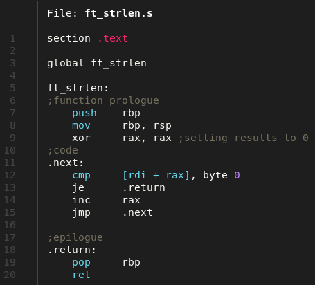

<h1 align=center>Libasm</h1>
<p align="center">
  
</p>

<p align="center">
  
</p>

## **📌 Description**  
Ce projet consiste à réécrire des fonctions standards de la libc en **langage assembleur (x86-64 NASM)**. L'objectif est de comprendre le fonctionnement bas niveau des programmes, la gestion des registres, des appels système et l'interaction entre l'ASM et le C.  

---

## **🎯 Objectifs**  
✔ **Apprendre l'assembleur x86-64** (registres, instructions, appels système).  
✔ **Implémenter des fonctions basiques** (`strlen`, `strcpy`, `read`, `write`, etc.).  
✔ **Lier l'ASM avec le C** (compilation, conventions d'appel ABI).  
✔ **Optimiser manuellement** des opérations critiques.  
✔ **Gérer les erreurs** (`errno`, vérification des arguments).  

---

## **📝 Fonctions à implémenter**  
| Fonction      | Description |  
|--------------|------------|  
| `ft_strlen`  | Version ASM de `strlen`. |  
| `ft_strcpy`  | Copie une chaîne comme `strcpy`. |  
| `ft_strcmp`  | Compare deux chaînes comme `strcmp`. |  
| `ft_write`   | Appel système `write` avec gestion d'erreurs. |  
| `ft_read`    | Appel système `read` avec gestion d'erreurs. |  
| `ft_strdup`    | Duplique une chaîne comme `strdup`. |  
| `(Bonus) ft_atoi_base` | Changement de base avec manipulation de stack. |  
| `(Bonus) ft_list_push_front` | Manipulation de listes chaînées: ajout de maillon. |  
| `(Bonus) ft_list_size` | Manipulation de listes chaînées: parcours de chaîne. |  
| `(Bonus) ft_list_sort` | Manipulation de listes chaînées: tri fusion. |  
| `(Bonus) ft_list_remove_if` | Manipulation de listes chaînées: retrait de maillon. |  

---

## **⚙️ Compilation & Utilisation**  
1. **Compiler la librairie** :  
   ```sh
   make
   ```
   avec bonus:
   ```sh
   make bonus
    ```
   Génère `libasm.a` (bibliothèque statique).  

2. **Tester avec un programme C** :  
   ```c
   #include "libasm.h"  
   int main() {  
       char str = "42";
       printf("ft_strlen(\"%s\") = %zu\n", str, ft_strlen(str));  
       return 0;  
   }  
   ```
   ```sh
   gcc -Wall -Wextra -Werror test.c -L. -lasm -o test
   ./test
   ```

3. **Exécuter les tests** `(optionnel)` :  
   ```sh
   make test
   ```
   ```sh
   make bonus_test
   ```
   Avec checks valgrind:
   ```sh
   make test_v
   ```
   ```sh
   make bonus_test
   ```

---

## **🔍 Debugging manuel**  
- Utiliser **`gdb`** pour analyser l'exécution :  

```bash
make debug
b _start
layout asm
layout reg
set disassembly_flavor intel # <=> set disassembly-f i
run
si # to move to the next instruction
```
To check the content of an addr pointed by a reg: `x/s (char*)$rsi`

---

## **📚 Ressources utiles** 
- [class x86 Assembly guide University of Virginia](https://www.cs.virginia.edu/`evans/cs216/guides/x86.html)
- [github klaudiagrz assembly presentation](https://github.com/0xAX/asm?tab=readme-ov-file)
- [class about registers and instructions](https://cs.brown.edu/courses/cs033/docs/guides/x64_cheatsheet.pdf) 
- [NASM Tutorial](https://nasm.us/doc/)  
- [Linux Syscall Table](https://chromium.googlesource.com/chromiumos/docs/+/master/constants/syscalls.md)

---
